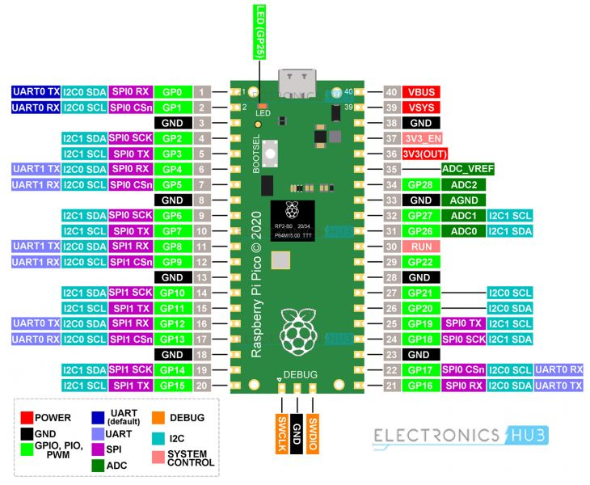

# Receive


PIN Name	Pin Description
VCC	Used to power up the RF receiver module. Unlike the transmitter, the supply voltage of the receiver is 5v.
GND	Ground pin of the module. Connect it with the controllers and encoder/decoders GND pin.
DATA	These pins output the digital data received. The two center pins are internally connected, so we can use either one of them for data output.
ANT	The antenna pin is not necessary to use but is recommended. The module can only operate  up to 3 meters without an antenna but its range can be extended up to 100 meters by using a small hookup wire as an Antenna


https://github.com/lexruee/pi-switch-python/blob/master/examples/test_receiver.py


https://github.com/peterhinch/micropython_remote

PIN Name	Pin Description
VCC	Used to power the RF receiver module.
GND	Ground pin of the module. Connect it with the controllers and encoder/decoders GND pin.
DATA	This is the data pin of the transmitter. It takes the data from the microcontroller or encoder and broadcast it via the antenna.
ANT	The antenna pin is not necessary to use but it is recommended. The module can only operate max 3 meters without an antenna but its range can be extendable up to 100 meters by using a small hookup wire as an Antennas


https://github.com/lexruee/pi-switch-python


# First steps - can I get a micropython blinky to work?

Reset pico and copied on rp2-pico-20220618-v1.19.1.uf2

Using Thonny - it struggled to find pico at first.

blinking LED with

```
from machine import Pin, Timer
led = Pin(25, Pin.OUT)
timer = Timer()

def blink(timer):
    led.toggle()

timer.init(freq=2.5, mode=Timer.PERIODIC, callback=blink)
```

Getting libs on pi some troublesome in micropython.

Failed to get python rshell to run

Installed Ampy with 

pip3 install adafruit-ampy

ampy --help


C:\Users\gibbens\Documents\Arduino\2022\pico433\micropython_remote-master>ampy --port COM4 ls
/code.py

This only worked after I closed thonny (doh!)

# 29th August 2022 #

Summary of today:

Breadboarded 5V -> 3V inverter buffer, as specified in Peter Hinch's readme.
Connected Receiver module.
Used Repl to capture signals from remote.
Used Repl to write signals to local file?

Listing signals using 'show'

Connected up Transmit module
Used Repl to load local file containing on and off code for channel 2.

Figured out the RX pin is GP17
Figured out the TX pin is GP16.

The transmitter needs at least 5V to function.
The socket didn't work out the box, required reps=10 in TX construction - as suggested in Peter Hinch's notes.


## Notes on 3-5V components ##
MPS2222A General Purpose NPN TO-92




## Notes from repl ##
```
from rx import RX
from rx.get_pin import pin
recv = RX(pin())

recv('on')

recv.save('remotes')
```

```
>>> recv('2on')
Awaiting radio data
Frame length = 50 No. of frames = 15
Averaging 15 frames
Capture quality   7.3 (perfect = 0)
Key "2on" stored.

>>> recv('2off')
Awaiting radio data
Frame length = 50 No. of frames = 14
Averaging 14 frames
Capture quality   7.5 (perfect = 0)
Key "2off" stored.

> recv.show('2on')
  0    287
  1    899
  2    876
  3    311
  4    876
  5    310
  6    875
  7    313
  8    287
  9    899
 10    287
 11    899
 12    289
 13    898
 14    288
 15    898
 16    876
 17    311
 18    289
 19    897
 20    876
 21    312
 22    875
 23    313
 24    875
 25    313
 26    874
 27    312
 28    287
 29    900
 30    286
 31    901
 32    286
 33    900
 34    287
 35    900
 36    287
 37    899
 38    875
 39    313
 40    875
 41    312
 42    874
 43    313
 44    287
 45    899
 46    874
 47    310
 48    287
 49   9612

> recv.show('2off')
  0    288
  1    898
  2    876
  3    311
  4    876
  5    311
  6    876
  7    311
  8    287
  9    899
 10    287
 11    899
 12    288
 13    898
 14    289
 15    897
 16    875
 17    312
 18    288
 19    899
 20    875
 21    313
 22    874
 23    312
 24    874
 25    312
 26    874
 27    313
 28    286
 29    900
 30    287
 31    900
 32    287
 33    899
 34    287
 35    900
 36    286
 37    900
 38    874
 39    312
 40    875
 41    313
 42    874
 43    313
 44    286
 45    899
 46    287
 47    896
 48    288
 49   9611

>>> recv.save('remotes')
Data saved in file remotes
>>> transmit = TX(pin(), 'remotes', reps=10)
>>> transmit('2on')  # Immediate return
>>> transmit('2off')  # Immediate return
```